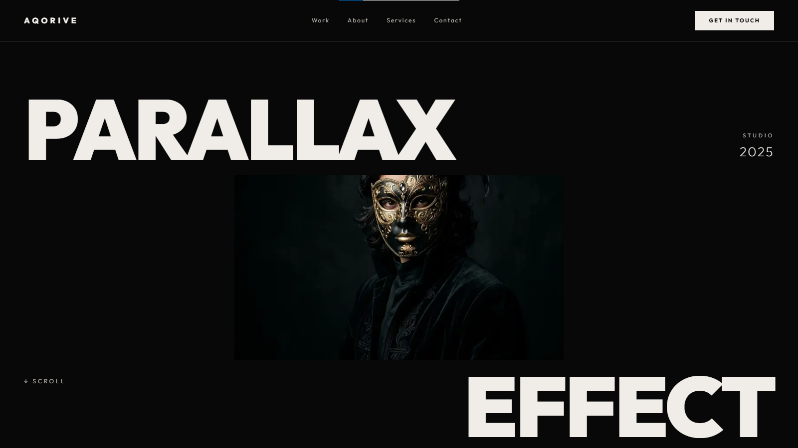

# AQORIVE ─ Cinematic Creative Studio

AQORIVE is a high-end, premium digital experience built with **Next.js**, **GSAP**, and **TypeScript**. It features a stunning masonry-style portfolio and cinematic parallax effects designed for luxury brands.

## Preview



## Core Features

- **Cinematic Portfolio**: High-end masonry grid with 12 dynamic image assets.
- **GSAP Animations**: Smooth, frame-by-frame parallax and scroll-triggered transitions.
- **Lenis Smooth Scroll**: For a luxurious, fluid scrolling experience.
- **Next.js & Tailwind**: Built for performance and modern web standards.

## Tech Stack

- **Framework**: Next.js 15
- **Logic**: TypeScript
- **Animation**: GSAP (ScrollTrigger)
- **Styling**: Vanilla CSS / TailwindCSS
- **Smooth Scroll**: Lenis

## Getting Started

First, run the development server:

```bash
npm run dev
# or
yarn dev
# or
pnpm dev
# or
bun dev
```

Open [http://localhost:3000](http://localhost:3000) with your browser to see the result.
